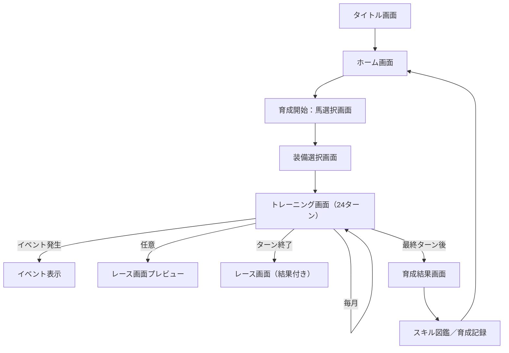

## 改良版 - 指摘を反映

---

### 🔄 複雑性の低減と実装効率化

#### 1. ステータス構成の簡略化
- **変更前**: 12種類の詳細なステータス
- **変更後**: 主要6ステータス(速力・柔軟・精神・技術・展開・持久)を中心に、必要に応じて補助ステータスを表示
- **メリット**: UIの簡略化、プレイヤーの理解しやすさ向上

#### 2. バランス調整枠組み
- **変更前**: 複雑な係数と多数の条件を含むバランス式
- **変更後**: プロトタイプでは単純な係数設計からスタート、プレイテスト後に徐々に調整
- **メリット**: 初期実装の容易さ、段階的な調整可能性

#### 3. モチベーション維持の工夫
- **追加**: 6ヶ月ごとの特別イベント/特訓期間を導入
- **追加**: 中間目標・小さな達成要素の設定（熟度レベルアップ、スキル開花など）
- **メリット**: 長期育成中のプレイヤー engagement 向上

---

### 🔧 技術的実装の現実化

#### 1. 開発プラットフォームの段階的アプローチ
- **変更前**: 初期からiOS対応を目指す
- **変更後**: PC/Web版でプロトタイプ開発 → コア機能安定後にiOS対応
- **メリット**: 開発サイクルの短縮、App Store審査リスクの回避

#### 2. データ構造の強化
- **追加**: データバリデーション層の導入で参照整合性を自動チェック
- **追加**: スキーマ検証による開発時エラーチェック
- **メリット**: 複雑なデータ関係における整合性の維持

---

### 🎮 プレイアビリティ向上

#### 1. チュートリアル設計
- **追加**: 複雑なシステムを段階的に学べるチュートリアル育成周回
- **追加**: UIヘルプ機能（初回アクセス時の説明表示）
- **メリット**: 初心者への学習曲線緩和

#### 2. 視覚的フィードバックの強化
- **実装完了**: トレーニング成果やスキル開花時の演出を実装
  - チャクラ共鳴演出（カテゴリ別の波紋エフェクト）
  - スキル開花時の通知とアニメーション（名称ポップアップ、色付け）
  - ステータス変化の視覚的表示（数値上昇アニメーション）
- **実装完了**: レース演出の強化
  - スキル発動エフェクト（波紋エフェクト、光彩）
  - 順位変動時のスムーズな移動アニメーション
  - 結果画面でのランク表示エフェクト（ランクに応じた色彩と輝き）
- **メリット**: プレイヤー体験の向上、報酬感の強化、直感的な状態把握

---

## 🧩 使用技術構成（想定）

### 🎮 ゲームエンジン

| 項目        | 内容                                           |
| --------- | -------------------------------------------- |
| **エンジン**  | [Godot Engine 4.x](https://godotengine.org/) |
| **言語**    | GDScript（必要に応じてC#併用可）                        |
| **ターゲット** | Web/PC版（初期）→ iOS（後期）                        |

---

### 📱 デプロイ計画

| フェーズ        | 内容                                    |
| ------------- | ------------------------------------- |
| **プロトタイプ**  | Web/PCブラウザ版（開発効率・テスト容易性重視）         |
| **ベータ版**     | Web版の機能拡充＋テストユーザーフィードバック           |
| **正式版**      | iOS版リリース（Apple App Store）          |
| **拡張フェーズ**  | Android版、機能追加、コンテンツ拡充など             |

---

### 📱 iPhoneアプリ対応

| 項目         | 内容                                   |
| ---------- | ------------------------------------ |
| **ビルド形式**  | Godot → Xcode Export（iOS Template利用） |
| **デバイス対応** | iPhone 11以降（画面比考慮）                   |
| **入力操作**   | タップ／スワイプ中心（縦画面想定）                    |
| **解像度設計**  | 可変レイアウト＋9:16基準アスペクト比対応               |

---

### 🎨 アセット・UI

| 項目          | 内容                                              |
| ----------- | ----------------------------------------------- |
| **UI実装**    | Godotの`Control`ノードベースUIシステム（Anchor／Container設計） |
| **フォント**    | 和風筆文字フォント（タイトル／演出）、丸ゴシック（本文UI）                  |
| **アニメーション** | Godotの`AnimationPlayer`・Tweenによる軽演出             |
| **演出効果**    | ✅ 実装済み：Shader・波紋・発光・カラーエフェクトを活用したチャクラ演出 <br>- 波紋シェーダー（同心円効果）<br>- 画面遷移エフェクト（フェード・サークル・ワイプ・ズーム）<br>- ステータス変化表示アニメーション<br>- スキル開花通知ポップアップ |

---

### 💾 データ管理（ローカル）

| 項目                | 内容                                 |
| ----------------- | ---------------------------------- |
| **セーブ方式**         | JSONによるローカルファイル保存（`user://`ディレクトリ） |
| **スキル・装備・トレーニング** | マスターデータJSONで管理、起動時に読み込み            |
| **実績記録**          | 育成記録・図鑑進捗なども同様にローカル保存              |

---

### 📦 拡張・配布予定（後工程）

| 項目        | 内容                                    |
| --------- | ------------------------------------- |
| **ストア配信** | Apple App Store（TestFlight経由のテスト可）    |
| **拡張予定**  | 将来的に：Android対応、ローカル対戦 or 記録共有、キャラ追加など |


このゲームは複数の要素（育成／ステータス／スキル／装備／レース／イベント／UI）で構成されているため、仕様書を**役割ごとに分割**し、順を追って設計していくのが現実的です。

---

## ✅ フル機能実装に必要な仕様書一覧（分類別）

### 1. 🧭 **育成サイクル・進行系**

| 仕様書名             | 内容                       |
| ---------------- | ------------------------ |
| 🗂 育成サイクル仕様書     | ターン構成（開始～終了）、月次処理、ルール全体  |
| 🗂 トレーニング仕様書     | 各カテゴリの定義／疲労／成長式／成功・失敗処理  |
| 🗂 状態変化仕様書       | 疲労・チャクラ共鳴・停滞・補助ゲージ等の状態定義 |
| 🗂 トレーニングバランス調整式 | 成長計算に使う補正係数とその条件一覧       |

---

### 2. 🛠 **装備・スキル・進行管理**

| 仕様書名        | 内容                        |
| ----------- | ------------------------- |
| 🗂 装備熟度仕様書  | 装備カテゴリごとの熟度進行・効果段階        |
| 🗂 スキル進行仕様書 | スキルの条件・進行・開花・タグ分類         |
| 🗂 スキルデータ仕様 | スキル一覧（ID・名称・効果・分類などデータ設計） |
| 🗂 スキル演出仕様  | 発動タイミング・演出ログ・効果UI反映など     |

---

### 3. 🏁 **レース系**

| 仕様書名          | 内容                      |
| ------------- | ----------------------- |
| 🗂 レース仕様書（全体） | 区間構成／ステスコア式／スキル処理全体フロー  |
| 🗂 レーススコア式仕様  | 各区間の計算式・スキル加点・失速ペナルティなど |
| 🗂 レースUI仕様書   | 表示内容・順位変化ログ・エフェクト・演出方針  |

---

### 4. 🖥 **UI・UX設計系**

| 仕様書名             | 内容                       |
| ---------------- | ------------------------ |
| 🗂 トレーニングUI仕様書   | 各ターン画面の要素／選択情報／共鳴・疲労UI表示 |
| 🗂 ステータス／熟度表示仕様書 | ステータス・熟度バー・補助ゲージなどのUI配置  |
| 🗂 レースUI仕様書（詳細）  | レース中の情報表示・エフェクト・スキルログ    |
| 🗂 スキル図鑑／育成記録UI  | 周回後の記録・スキル収集・成長履歴表示系UI   |

---

### 5. 📜 **イベント・世界観系（発展フェーズ）**

| 仕様書名              | 内容                      |
| ----------------- | ----------------------- |
| 🗂 イベント仕様書        | ランダムイベント／選択肢分岐／スキルや熟度影響 |
| 🗂 ストーリー・世界観演出仕様書 | チャクラ・導師・流派・UIにおける表現方針   |

---

### 6. 📂 その他（データ構造・設計補助）

| 仕様書名          | 内容                      |
| ------------- | ----------------------- |
| 🗂 データスキーマ設計書 | キャラ／装備／スキル／育成進行のデータ構造   |
| 🗂 状態フラグ一覧    | 各状態（疲労・熟度・補助ゲージなど）の変遷条件 |

---

## ✅ 優先設計順（おすすめ進行）

1. **育成サイクル仕様書（ゲーム骨格）**
2. **トレーニング仕様＋バランス調整式（成長処理）**
3. **装備熟度＋スキル進行仕様書（育成結果に関与）**
4. **レース仕様＋スコア式（成果評価ロジック）**
5. **UI仕様（画面設計ベース）**
6. イベント・図鑑などの拡張仕様

---

## ✅ 次のステップ提案

この構成でよろしければ、まず
👉 \*\*「育成サイクル仕様書」\*\*から詳細に入り、順番に設計していきましょうか？

もしくは特に最初に設計したい領域があれば教えてください。
## 📘 育成サイクル仕様書

---

### ✅ 基本構造

| 項目    | 内容                    |
| ----- | --------------------- |
| 開始月   | 3歳4月                  |
| 終了月   | 5歳12月                 |
| ターン数  | 計33ターン（月次1ターン × 33ヶ月） |
| レース回数 | 最低2回（自由な月に参加）         |

---

### ✅ 月次処理フロー（1ターン＝1ヶ月）

1. **チャクラ気配の決定**（1カテゴリに流れが発生）
2. **トレーニング選択**（6カテゴリから1件ずつ表示）

   * 共鳴候補・疲労・スキル条件表示あり
3. **トレーニング実行処理**

   * ステ成長、疲労上昇、熟度加算、スキル進行、共鳴演出
   * トレーニング失敗 or 成功の分岐（疲労影響）
4. **イベント処理（任意）**

   * 月に1回、一定確率でイベント or 選択肢発生（未実装でも可）
5. **ターン終了処理**

   * スキル進行の可視化、ログ演出、疲労UI更新

---

### ✅ レーススケジュール（仮ルール）

* レースは**自由選択型**（12ターン目／24ターン目推奨）
* 3歳12月までに1戦以上、5歳12月までに2戦以上推奨
* 出走可能タイミングでは選択肢：「今月はレースに出ますか？」

---

### ✅ 特別トレーニング期間

* 6ヶ月ごとに「特別トレーニング月間」が発生（例：3歳10月、4歳4月、4歳10月、5歳4月）
* 特別月間の効果：
  * チャクラ共鳴確率2倍
  * 全トレーニング効果+20%
  * 特殊イベント発生確率上昇
* 特別月間はカレンダーでハイライト表示（UI色変化）

---

### ✅ ターン内の各状態更新内容

| 処理タイミング | 内容                             |
| ------- | ------------------------------ |
| トレ選択時   | チャクラ気配カテゴリ確認、補助ゲージ進捗確認、停滞状態表示  |
| トレ実行時   | 疲労加算、ステ上昇、熟度加算、スキル進行、失敗分岐、共鳴抽選 |
| ターン終了時  | スキルバー更新、イベント発生抽選、状態ログ出力        |

---

### ✅ 成長上限／疲労制御（上位仕様に委譲）

* ステータスの最大成長量／疲労管理などは別仕様「バランス調整式」参照
* 熟度・スキル進行も別仕様にて係数と連動

---

### ✅ 補足仕様（必要に応じて）

* 固有イベントや特殊月（正月・夏・秋）演出追加可
* 特訓月（2倍共鳴発動率／スキル進行加速）なども拡張可能

---

この仕様はゲームの「育成フェーズ全体の時間構造と月次ルール」を定めるものであり、他の仕様（トレーニング・装備・レースなど）との連動をベースに設計されています。---
title: "トレーニングカテゴリ一覧（6カテゴリ）"
free: false
---

## 🏋️ トレーニング仕様書

---

### ✅ トレーニングカテゴリ一覧（6カテゴリ）

| カテゴリ | 主なステータス | 疲労値 | 成長量（基礎）      |
| ---- | ------- | --- | ------------ |
| 速力系  | スピード／反応 | +30 | +6／+2        |
| 柔軟系  | 柔軟性／姿勢  | +20 | +6／+2        |
| 精神系  | 精神／集中力  | +10 | +4／+3（疲労-10） |
| 技術系  | 技術／対応力  | +25 | +5／+1        |
| 展開系  | 読み／判断力  | +25 | +5／+2        |
| 持久系  | スタミナ／体力 | +30 | +6／+2        |

---

### ✅ トレーニング処理の構造

```
1. トレーニング選択
2. 疲労値加算（カテゴリに応じて）
3. 成長計算 → ステータス加算（調整式適用）
4. 熟度加算（装備カテゴリと一致で+10pt／非一致で+2pt）
5. スキル進行ポイント加算（該当スキルに+1 or 共鳴で+2）
6. 共鳴判定（条件一致で確率抽選）
7. トレーニング成功／失敗判定
```

---

### ✅ 疲労・成功判定仕様

| 疲労範囲   | 成功確率 | 備考         |
| ------ | ---- | ---------- |
| 0〜59   | 100% | 通常成功       |
| 60〜79  | 70%  | 失敗率上昇（30%） |
| 80〜100 | 30%  | 失敗率大（70%）  |

#### 失敗時の効果

* ステータス上昇なし
* スキル進行なし
* 疲労+5（追い疲労）
* 特殊ログ「型が乱れた……」

---

### ✅ チャクラ共鳴仕様（簡易）

* 条件：

  * 月のチャクラ気配カテゴリ = トレカテゴリ
  * トレカテゴリ = 装備カテゴリ
* 成功確率：40%（熟度による補正あり）
* 成果：

  * ステ成長 +50%
  * スキル進行 +1pt
  * 熟度 +2pt
  * 共鳴ログ演出あり

---

### ✅ 成長式（簡易）

```
最終ステ加算 = 基礎成長量 × 調整係数 × ボーナス補正
```

* 調整係数：疲労状態、チャクラ停滞、ステ限界などで変動
* ボーナス補正：共鳴、装備、イベント、スキル効果

---

### ✅ その他補足

* トレーニング表示数は毎月各カテゴリ1件ずつ（ランダム名・同一カテゴリでも内容差分可）
* 精神トレは唯一疲労回復を兼ねる（-10）
* チャクラ停滞や補助ゲージ、熟度段階などは関連仕様を参照

---

この仕様は、育成フェーズにおける「成長の中核ロジック」を定義するものであり、ステ成長・熟度・スキル・状態変化を同時に処理する基盤となります。---
title: "状態変化仕様書（疲労・チャクラ共鳴・停滞・補助ゲージなど）"
free: false
---

## 🌀 状態変化仕様書（疲労・チャクラ共鳴・停滞・補助ゲージなど）

---

### ✅ 1. 疲労（Fatigue）

| 項目      | 内容                          |
| ------- | --------------------------- |
| 上限値     | 100                         |
| 加算方法    | トレーニング実行時、カテゴリに応じて加算（10〜30） |
| 減少方法    | 精神系トレーニング（-10）、休養（-50）      |
| 成功率への影響 |                             |

* 0〜59：成功率100%
* 60〜79：成功率70%
* 80〜100：成功率30% |
  \| トレーニング失敗時 |
* ステ上昇なし
* スキル進行なし
* 疲労+5（追加負荷）
* 特殊ログ表示「型が乱れた……」 |

---

### ✅ 2. チャクラ共鳴（Chakra Resonance）

\| 発動条件 |

* 当月のチャクラ気配カテゴリ = トレカテゴリ
* トレカテゴリ = 装備カテゴリ |
  \| 成功確率 | 40%（熟度Lv2以上で+10%、Lv3以上で+20%） |
  \| 効果 |
* ステ成長 +50%
* スキル進行 +2pt
* 熟度 +2pt
* ログ「チャクラが震えた……」 |

---

### ✅ 3. チャクラの停滞（Chakra Stagnation）

\| 発動条件 | 同一カテゴリを3ヶ月以上連続で選択した場合 |
\| 効果 |

* トレ効果 -20%
* チャクラ共鳴が発生しない（無効）
* ログ「チャクラが一点に淀み始めている……」 |
  \| 解除条件 | 他カテゴリのトレーニングを1回以上実行する |

---

### ✅ 4. チャクラ補助ゲージ（Resonance Buffer）

\| 概要 | 装備カテゴリと一致しないトレーニング実行時に蓄積されるゲージ |
\| ゲージ増加 | 非一致カテゴリで +1pt（最大5pt） |
\| 発動条件 | 5ptに達した状態で一致カテゴリのトレーニングを実行 |
\| 効果 |

* 100%チャクラ共鳴が発生（確定）
* ゲージはリセット（0pt）
* ログ「溜めていたチャクラが一気に流れ出した！」 |

---

### ✅ 状態の重複と優先順位

| 状態                 | 共鳴判定の可否 | 効果加算               |
| ------------------ | ------- | ------------------ |
| 共鳴条件成立 + 停滞状態      | ❌ 共鳴無効  | 停滞による効果低下優先        |
| 共鳴条件未成立 + 補助ゲージ5pt | ✅ 確定共鳴  | ゲージ優先で発動 → ゲージリセット |

---

この仕様は、トレーニングの結果を左右する「状態変化」を定義するものであり、
プレイヤーの選択に戦略性と揺らぎ（変化）をもたらす設計の根幹となります。---
title: "トレーニングバランス調整式（補正係数仕様）"
free: false
---

## ⚖️ トレーニングバランス調整式（補正係数仕様）

---

### ✅ 1. 基本式

```
最終成長量 = 基礎成長値 × 調整係数 × ボーナス補正
```

| 用語     | 定義                         |
| ------ | -------------------------- |
| 基礎成長値  | 各トレーニングに定められたベース数値（例：速力+6） |
| 調整係数   | 状態（疲労・停滞・熟度）に応じて変動する係数     |
| ボーナス補正 | 共鳴／装備効果／スキル補正／イベントバフなど     |

---

### ✅ 2. 調整係数（状態による変動）

| 状態      | 条件            | 係数            |
| ------- | ------------- | ------------- |
| 疲労      | 0〜59          | ×1.0          |
| 疲労      | 60〜79         | ×0.8          |
| 疲労      | 80〜100        | ×0.5          |
| チャクラ停滞中 | 連続3回以上同カテゴリ選択 | ×0.8（疲労係数と乗算） |
| ステータス制限 | ステ100超過       | ×0.9（ソフト減衰）   |
| ステータス制限 | ステ120超過       | ×0.7（強め減衰）    |

---

### ✅ 3. ボーナス補正（成長を増加させる要素）

| 要素        | 効果量                |
| --------- | ------------------ |
| チャクラ共鳴    | +50%（×1.5）         |
| 装備補正（SSR） | +10〜20%（トレカテゴリ一致時） |
| 熟度段階      | Lv2→+10%、Lv3→+20%  |
| スキル効果     | パッシブ効果（例：技術トレ+10%） |
| イベント効果    | 一時的に特定カテゴリ+30%など   |

※ 各ボーナスは原則乗算され、複数重なることもある。

---

### ✅ 4. 成長値の丸め処理

* 小数点第1位で四捨五入（例：7.6 → +8）
* 1回のトレーニングで成長値が1未満になった場合でも最低+1保証

---

### ✅ 5. 成長式の例

> 【状況】
>
> * 精神トレ（基礎：精神+4、集中+3）
> * 疲労75 → 調整係数×0.8
> * 熟度Lv2 → +10%（×1.1）
> * チャクラ共鳴成功 → ×1.5

```
精神成長：4 × 0.8 × 1.1 × 1.5 = 5.28 → +5
集中成長：3 × 0.8 × 1.1 × 1.5 = 3.96 → +4
```

---

この補正式により、同じトレーニングでも状態や構成に応じて成果が大きく揺らぐため、育成戦略に深みが生まれます。---
title: "装備熟度仕様書（Chakra Attunement）"
free: false
---

## 🧘 装備熟度仕様書（Chakra Attunement）

---

### ✅ 概要

装備熟度とは、プレイヤーが装備している各カテゴリの装備（騎手・馬・導法書）との調和を表す値であり、トレーニングを通じて蓄積され、スキル進行や共鳴率に影響を与える。

---

### ✅ 熟度の基本ルール

| 条件              | 加算量               |
| --------------- | ----------------- |
| 装備カテゴリと一致するトレ選択 | +10pt             |
| 非一致カテゴリのトレ選択    | +2pt              |
| トレ失敗時           | 通常通り加算（努力は蓄積とみなす） |
| 上限値             | 100pt（超過分は無効）     |

---

### ✅ 熟度段階と効果

| 熟度帯   | 表示段階 | 効果                          |
| ----- | ---- | --------------------------- |
| 0〜19  | Lv.1 | 通常状態（補正なし）                  |
| 20〜49 | Lv.2 | スキル進行 +1pt／補助チャクラ蓄積+1補正（任意） |
| 50〜79 | Lv.3 | チャクラ共鳴率 +10%／スキル開花確率補正      |
| 80〜99 | Lv.4 | 熟練共鳴演出追加／共鳴時スキル即開花チャンス      |
| 100   | MAX  | 奥義スキル候補が表示／スキルLv上昇・効果強化     |

---

### ✅ 熟度の影響範囲

* チャクラ共鳴判定時：

  * Lv.2以上 → +10%
  * Lv.3以上 → +20%
* スキル進行：

  * Lv.2以上 → スキル進行時 +1pt（累積）
  * Lv.4以上 → 共鳴時スキル即開花 or 奥義抽選（確率式）

---

### ✅ UI表示方針

* 各装備ごとに熟度バー表示（0〜100）＋段階（Lv.1〜MAX）
* トレーニング時の加算ログ：「〇〇との調和が深まった（熟度+10）」
* MAX時ログ：「完全なる調和……チャクラが満ちた！」

---

### ✅ 備考

* 熟度は「その育成中のみ保持」され、次回育成ではリセットされる
* 熟度段階によって開放されるスキルの種類・数も変化可能（今後拡張）

---

この仕様は、装備とトレーニングの関係性を"積み重ね"として可視化・活用する仕組みであり、育成方針に深みと蓄積感を与えるための重要な要素である。---
title: "スキル進行仕様書（開花条件・進行・分類タグ）"
free: false
---

## 🧠 スキル進行仕様書（開花条件・進行・分類タグ）

---

### ✅ スキルの基本構造

| 要素     | 内容                      |
| ------ | ----------------------- |
| スキルID  | 固有識別子（例：SKL001）         |
| スキル名   | 表示名（例：無音疾風）             |
| スキル効果  | レース中に発動するバフ・加点処理などのロジック |
| 発動条件   | 区間・状況など（例：終盤／速力劣勢時）     |
| 関連カテゴリ | トレーニングカテゴリ（例：速力／精神）     |
| タグ分類   | スキル種別タグ（速力系／展開系／精神系など）  |

---

### ✅ スキル進行と開花条件

#### 開花の流れ

1. 装備ごとに「スキル候補」が最大3種設定されている
2. スキルごとに"進行条件"が定義（例：速力×2、精神×1）
3. 条件を満たすと進行バーが出現（最大5pt）
4. トレーニング実行で該当スキルの進行が +1（共鳴時 +2）
5. 進行5ptに到達でスキル開花 → 獲得ログ＆UI演出

#### 条件例

| スキル名 | 条件          |
| ---- | ----------- |
| 柔式転身 | 柔軟×2 + 精神×1 |
| 無音疾風 | 速力×2 + 技術×1 |
| 静心制圧 | 精神×3 + 展開×1 |

---

### ✅ タグ分類（系統と役割）

| タグ  | 内容例                |
| --- | ------------------ |
| 速力系 | 加速・速力強化・前方追い抜き加点など |
| 持久系 | スタミナ維持・疲労緩和・後半加速など |
| 精神系 | 集中維持・スキル発動率上昇など    |
| 展開系 | 区間読み強化・順位操作・戦略加点など |
| 技術系 | 状況対応力・バランス補正など     |
| 反応系 | スタート加点・追走／追込補助など   |

---

### ✅ UI表示・進行演出

* 条件達成時：スキル枠が出現し、進行バー表示（0〜5）
* トレ実行時：対象スキルに+1pt／共鳴時+2pt
* 開花時：スキル名表示＋「新たな技が閃いた！」ログ＋図鑑登録
* 奥義スキルなどは熟度MAX状態で条件を満たすと確率表示

---

この仕様により、スキル開花は「装備・トレーニング・カテゴリ選択の連携」によって自然に発生し、プレイヤーの育成選択と成果のつながりを強く実感できる体験を提供します。---
title: "スキルデータ仕様書（構造・一覧例）"
free: false
---

## 📊 スキルデータ仕様書（構造・一覧例）

---

### ✅ スキルデータ構造（1件あたりの定義）

```ts
Skill {
  id: string;              // スキルID（例：SKL001）
  name: string;            // 表示名（例：無音疾風）
  description: string;     // 効果説明文
  effect: SkillEffect;     // レース中の効果（例：終盤加速+10）
  condition: SkillCondition; // 発動条件（例：終盤／3位以下）
  categoryTags: string[];  // タグ（速力系、精神系など）
  requiredTraining: string[]; // 開花に必要なカテゴリ（例：['速力', '精神']）
  progressThreshold: number; // 開花に必要な進行ポイント（例：5）
  rarity?: 'normal' | 'rare' | 'secret';
  unlockedBy?: string[];   // 習得可能な装備ID一覧
}
```

---

### ✅ SkillEffect構造（例）

```ts
SkillEffect {
  timing: 'start' | 'early' | 'middle' | 'final';
  bonusType: 'speed' | 'stamina' | 'control' | 'score';
  value: number;  // 加点 or 補正量（例：+10）
  duration?: number;  // 持続ターン（秒数換算 or 区間数）
  notes?: string;  // 補足説明（例：条件下のみ発動）
}
```

---

### ✅ SkillCondition構造（例）

```ts
SkillCondition {
  trigger: 'always' | 'when_losing' | 'when_ahead' | 'low_stamina';
  position?: 'top' | 'mid' | 'bottom';
  section?: 'early' | 'middle' | 'final';
}
```

---

### ✅ スキルデータ例（3種）

```json
[
  {
    "id": "SKL001",
    "name": "無音疾風",
    "description": "終盤、静かに加速し順位を上げやすくなる",
    "effect": { "timing": "final", "bonusType": "speed", "value": 15 },
    "condition": { "trigger": "when_losing", "position": "mid", "section": "final" },
    "categoryTags": ["速力系"],
    "requiredTraining": ["速力", "技術"],
    "progressThreshold": 5
  },
  {
    "id": "SKL002",
    "name": "静心制圧",
    "description": "中盤、精神が安定して展開を読む力が強まる",
    "effect": { "timing": "middle", "bonusType": "control", "value": 10 },
    "condition": { "trigger": "always", "section": "middle" },
    "categoryTags": ["精神系", "展開系"],
    "requiredTraining": ["精神", "展開"],
    "progressThreshold": 5
  },
  {
    "id": "SKL003",
    "name": "柔式転身",
    "description": "スタート時、柔軟な動きで有利な位置を取る",
    "effect": { "timing": "start", "bonusType": "control", "value": 8 },
    "condition": { "trigger": "always", "section": "early" },
    "categoryTags": ["柔軟系"],
    "requiredTraining": ["柔軟", "精神"],
    "progressThreshold": 5
  }
]
```

---

この仕様により、スキルデータは構造化されてゲーム処理・演出・UI表示・条件ロジックに一貫して活用できます。
スキル図鑑や習得制限、レアスキル管理にもスムーズに連携可能です。---
title: "スキル演出仕様書（発動タイミング・ログ・UI表示）"
free: false
---

## ✨ スキル演出仕様書（発動タイミング・ログ・UI表示）

---

### ✅ 1. スキル発動タイミング分類

| タイミング  | 説明          | 主な対象例             |
| ------ | ----------- | ----------------- |
| レース開始前 | 常時発動系、バフ適用  | スタート補正、初期集中強化など   |
| 区間開始時  | 該当区間に突入時に発火 | 終盤加速、中盤制圧など       |
| 状況反応型  | 条件成立時に即時発火  | 劣勢時補正、スタミナ低下時加速など |

---

### ✅ 2. 演出構成要素

| 要素      | 内容                              |
| ------- | ------------------------------- |
| テキストログ  | 固有メッセージ（スキルごとに定義）               |
| 発動エフェクト | チャクラ風アニメーション or ライトフラッシュ（演出簡略可） |
| スキル名表示  | 中央または右下にフェード表示（例：「無音疾風 発動！」）    |
| UI強調    | ステータス補正時は一時的にゲージ点滅 or 枠光彩       |

---

### ✅ 3. ログ出力例

| スキル名 | ログ文例               |
| ---- | ------------------ |
| 無音疾風 | チャクラが迸る──「無音疾風」発動！ |
| 静心制圧 | 深く静かな集中が、展開を制する！   |
| 柔式転身 | 柔の構え──開幕から形が決まった！  |

※ ログはスキルの個性やカテゴリ性に合わせて演出文言をカスタマイズ

---

### ✅ 4. UI表示仕様

* 発動中のスキルは右下にログスタック表示（3件程度）
* 発動エフェクトは色分け（速力=青、精神=紫、展開=緑 など）
* チャクラ共鳴由来スキルは背景に波紋エフェクト演出
* 奥義スキル発動時は演出強調（画面中央点滅／名前テロップ）

---

### ✅ 5. 簡略モード対応（演出スキップ）

* スキップON時はログのみ表示（演出カット）
* 結果画面で発動スキルを一覧表示可能に

---

この仕様により、スキルの個性とカテゴリ性を"演出"として感じさせつつ、情報過多にならない軽量なUI演出でテンポよくレースを体験できる構成となります。---
title: "レース仕様書（全体設計）"
free: false
---

## 🏁 レース仕様書（全体設計）

---

### ✅ 1. レース構成概要

| 項目   | 内容                             |
| ---- | ------------------------------ |
| 区間構成 | 3区間（序盤・中盤・終盤）                  |
| 処理単位 | 各区間ごとにスコア計算／スキル発動判定実施          |
| 評価方法 | 最終スコア = 区間スコア合計 + スキル加点 - 失速補正 |
| 勝敗決定 | 全馬のスコアを比較し順位を決定                |

---

### ✅ 2. スコア計算（各区間）

各区間ではステータスに応じたスコア計算を実施：

```ts
score = Σ(ステータス × 区間係数) + 発動スキル加点
```

#### 区間別ステータス比重（例）

| 区間 | 速力  | 柔軟性 | 精神  | 技術  | 展開力 | 持久力 |
| -- | --- | --- | --- | --- | --- | --- |
| 序盤 | 40% | 15% | 10% | 10% | 15% | 10% |
| 中盤 | 25% | 10% | 15% | 20% | 20% | 10% |
| 終盤 | 30% | 10% | 15% | 10% | 10% | 25% |

---

### ✅ 3. スキル処理フロー

1. レース前：常時発動系スキル（ステ補正系）を適用
2. 各区間：

   * ステスコア算出
   * 発動条件に合致するスキルを自動発動（加点 or 補正）
   * 疲労・精神低下による失速補正を適用（-5〜-15）
3. 全区間終了後：最終スコアを合計
4. 着順決定：スコア降順で並び順位を決定

---

### ✅ 4. スキル加点・補正処理

| タイミング | 処理内容                     |
| ----- | ------------------------ |
| 開始前   | 初期集中力やステータス補正を一括適用       |
| 区間突入時 | 区間スキル（速度+10など）を加算／UI演出発火 |
| 状況発動  | 条件が満たされた時点で即時発動・補正反映     |

---

### ✅ 5. 特殊補正ロジック

* 疲労が80以上：各区間に -10〜-15 のペナルティ（ステと別）
* 精神が50未満：集中力欠如 → スキル発動確率-20%（発展要素）
* スキルが重複発動：同系統スキルは加点値の低い方を無効化

---

### ✅ 6. 結果出力項目

| 項目      | 内容                  |
| ------- | ------------------- |
| 着順      | 順位（1〜N）             |
| 最終スコア   | 区間＋スキル＋ペナルティ計       |
| 発動スキル一覧 | 名前・発動区間・効果          |
| ステータス内訳 | 各区間ごとの貢献ステ表示（棒グラフ可） |

---

このレース仕様により、育成成果（ステータス・スキル）が明確にレース結果へ反映され、納得感と戦略性ある勝敗判断が可能になります。---
title: "レーススコア式仕様書（各区間スコア・スキル加点・ペナルティ）"
free: false
---

## 🧮 レーススコア式仕様書（各区間スコア・スキル加点・ペナルティ）

---

### ✅ 1. スコア全体構成

```
最終スコア = 序盤スコア + 中盤スコア + 終盤スコア + スキル加点 - ペナルティ
```

* 各区間スコアは、ステータスに基づく係数加重合計で算出
* スキル加点は発動時点で即時加算
* 疲労や精神状態による失速などが減点として適用される

---

### ✅ 2. 各区間のスコア式

```
区間スコア = Σ(各ステータス × 区間ごとの係数)
```

#### ステータス別係数（例）

| ステータス | 序盤  | 中盤  | 終盤  |
| ------ | --- | --- | --- |
| スピード  | 0.4 | 0.2 | 0.3 |
| 柔軟性   | 0.15| 0.1 | 0.1 |
| 精神    | 0.1 | 0.15| 0.15|
| 技術    | 0.1 | 0.2 | 0.1 |
| 展開力   | 0.15| 0.2 | 0.1 |
| 持久力   | 0.1 | 0.15| 0.25|

> ※ 補助ステータスはスキル発動条件やボーナス効果として反映

---

### ✅ 3. スキル加点ロジック

| 発動タイミング | 加点量    | 備考                |
| ------- | ------ | ----------------- |
| 開始前     | +5〜10  | 常時発動型（精神集中など）     |
| 区間内     | +8〜15  | 区間発動型（無音疾風など）     |
| 状況発動    | +10〜20 | 条件成立時（劣勢補正・スパート系） |

* 奥義スキルは最大 +30（条件厳）
* 同一カテゴリのスキルが複数ある場合、基本的に最大1個のみ発動

---

### ✅ 4. 失速・ペナルティ計算

| 条件      | 減点量              | 備考                |
| ------- | ---------------- | ----------------- |
| 疲労 > 80 | -10〜-15          | 区間ごとに適用           |
| 精神 < 50 | -5〜-10           | スキル発動失敗率 + 表示演出あり |
| 技術 < 40 | -5（コース取り失敗など演出用） |                   |

---

### ✅ 5. 発展設計（拡張余地）

* スキルの「タグ加点」方式により、各カテゴリの偏りを調整可
* スコアに"天候"や"馬場状態"の係数補正を加える余地あり
* 固有スキルや"相手との相性"による相対ボーナスも検討可能

---

このスコア仕様は、育成で積み重ねたステータスとスキル構成がレースの勝敗に直結する設計の核となり、納得感ある評価と競技性を生み出します。---
title: "レース画面構成（3区間制）"
free: false
---

## 🖥️ レースUI仕様書（表示・ログ・演出）

---

### ✅ 1. レース画面構成（3区間制）

| エリア | 内容                             |
| --- | ------------------------------ |
| 上部  | 区間表示（序盤／中盤／終盤）、進行バー            |
| 中央  | 馬アイコン相対演出（縦 or 横スクロール）＋区間内順位表現 |
| 下部  | スキル発動ログ／ステ変動ログの表示欄             |
| 右下  | スキップボタン、ログ確認、演出切替ボタン           |

---

### ✅ 2. 表示要素

| 要素     | 表示内容                         |
| ------ | ---------------------------- |
| 現在区間   | テキスト／帯グラデーション                |
| 各馬アイコン | 名前・順位・オーラ（スキル発動中など）          |
| スキルログ  | 右下にスタック（最大3件）                |
| 区間成績ログ | 「展開を読み切った！」「集中が乱れた…」など演出テキスト |
| チャクラ共鳴 | 波紋エフェクト／枠の光彩（紫〜青）            |

---

### ✅ 3. 順位演出・スコア更新

| タイミング | 表現                            |
| ----- | ----------------------------- |
| 区間終了  | 各馬のスコア表示演出（増加エフェクト付き）         |
| 順位変化時 | アイコンが滑らかに上下／左右に移動、順位番号にバウンス演出 |
| ゴール時  | 背景フェード→結果画面へスライド遷移            |

---

### ✅ 4. スキル発動演出

| 演出    | 内容                        |
| ----- | ------------------------- |
| 通常スキル | テキスト＋軽エフェクト（発光／震え）        |
| 共鳴スキル | 波紋＋スキル名が中央帯に流れる           |
| 奥義スキル | 演出遅延＋全画面反転／紫閃光→技名演出（最大2秒） |

---

### ✅ 5. レース終了後：結果表示

| 表示内容 | 備考                      |
| ---- | ----------------------- |
| 着順一覧 | 順位／名前／最終スコア／発動スキル数      |
| 自馬詳細 | 各区間スコア内訳／発動スキル一覧＋効果ログ   |
| 特殊演出 | 勝利時＝金光、2位〜3位＝銀色、下位＝簡素演出 |

---

### ✅ 6. トーン・演出方針

* 基調色：墨／紺／紫に差し色で金・赤（演出時）
* 音響：笛・鈴系効果音を中心に控えめ和テイスト
* テキスト中心で情報提示、演出は"控えめに強い"

---

この仕様は、テンポよく結果を見せながらも、トレーニング成果やスキル発動による緊張感と達成感を味わえる演出を重視した構成です。---
title: "トレーニングUI仕様書（各ターン画面構成・状態表示）"
free: false
---

## 🖥️ トレーニングUI仕様書（各ターン画面構成・状態表示）

---

### ✅ 1. 全体レイアウト構成

| エリア | 表示内容                                    |
| --- | --------------------------------------- |
| 上部  | 月表示（例：4月・5歳）／ターン数（残り）／チャクラ気配カテゴリ表示      |
| 左側  | プレイヤー状態パネル（ステータス一覧・疲労バー・装備熟度バー・スキル進行状況） |
| 中央  | トレーニング選択パネル（6種のカテゴリ枠）                   |
| 右側  | 選択中トレーニングの詳細（効果・疲労・共鳴・熟度加算など）           |
| 下部  | ボタン（決定・休養・レース出走）／補助ゲージ・共鳴状態ログ欄          |

---

### ✅ 2. トレーニング選択パネル（中央）

* 各カテゴリ（速力〜持久）から1件ずつ表示（計6件）
* 各トレーニングカードに以下の情報を表示：

  * 名称（例：霞走法）
  * 成長対象ステータス（主／副）とその量（例：速力+6／反応+2）
  * 疲労上昇量（例：+30）
  * 共鳴候補アイコン（チャクラ気配・装備一致）
  * 停滞警告アイコン（同一カテゴリ3連続）

---

### ✅ 3. プレイヤー状態パネル（左）

#### 3.1 ステータス表示（12種）

* 各ステータスは縦並び or 2列構成で表示
* 各項目に数値 + アイコン + ゲージバー（%表示）
* 上限（例：100）を超えた場合は色変化（光彩）

#### 3.2 疲労表示

* 疲労バー：ゲージ（0〜100）

  * 青（0〜59）、黄（60〜79）、赤（80〜100）
* 数値ラベル付き（例：疲労 72）
* 成功率インジケータ（色付き補足テキスト）

#### 3.3 熟度表示（騎手／馬／導法書）

* 各カテゴリに熟度バー（0〜100）＋Lv表示（Lv.1〜MAX）
* カラー：白→水色→紫→金（熟度段階に応じて）
* バーの右に残り必要pt（例：あと12でLvUP）表示可

#### 3.4 チャクラ補助ゲージ

* 非一致トレ選択時に+1pt
* 上限5ptで確定共鳴発生
* 表示形式：5マスの波紋風アイコン（1マスずつ点灯）
* ゲージ満了時：金色アニメ＋「チャクラ満了」ログ表示

#### 3.5 スキル進行状況

* 条件達成済みスキルのみ表示
* スキル名＋進行バー（0〜5pt）＋「あと〇ptで開花」ラベル
* 共鳴発動で+2pt反映時はアニメーション付き

---

### ✅ 4. 選択中トレーニング詳細表示（右）

| 表示項目    | 内容                           |
| ------- | ---------------------------- |
| トレーニング名 | 固有名（例：影走術）                   |
| 成長値     | 主／副ステータスの加算値（+X）             |
| 疲労値     | ＋数値（例：+20）＋成功率参考表示（例：成功率70%） |
| 熟度加算    | +10 or +2（装備一致か否か）           |
| 共鳴状態    | 共鳴候補・補助ゲージによる共鳴確定演出（バッジ表示）   |

---

### ✅ 5. 下部ボタン・操作要素

| ボタン      | 説明                        |
| -------- | ------------------------- |
| トレーニング決定 | 選択中のトレを実行                 |
| 休養       | 疲労 -50、トレーニング処理なし（1ターン消費） |
| レース出走    | 任意の月に手動出走（UI演出付き）         |
| ログ確認     | ステータス変動・スキル進行履歴などを一覧表示    |

---

### ✅ 補足演出・視認性

* 共鳴：波紋・光彩演出で「今月これが強い」が直感的に伝わる
* 停滞：警告色・モヤ表示で注意喚起
* 疲労：数値の背景が赤系に変化し、失敗リスクを視覚化

---

このUI仕様により、トレーニングごとの判断要素（成長／疲労／共鳴）を明確に提示しつつ、導的世界観とプレイヤーの戦略性を両立したプレイ体験を設計できます。---
title: "レースUI仕様書（詳細）"
free: false
---

## 🎬 レースUI仕様書（詳細）

---

### ✅ 1. レース進行画面構成

| セクション | 内容                                         |
| ----- | ------------------------------------------ |
| 上部バー  | 現在の区間表示（序盤・中盤・終盤）／レース全体進行ゲージ（33%・66%・100%） |
| 中央表示  | 馬アイコンの順位演出（横スクロール or リスト更新）＋エフェクトオーバーレイ    |
| 下部ログ欄 | スキル発動・チャクラ共鳴・集中乱れ等のログを表示（3〜5件をスタック）        |
| 右下操作系 | スキップボタン／演出オンオフ切替／リザルトへボタン（完走時）             |

---

### ✅ 2. 馬アイコン表示（中央）

| 表示内容    | 詳細                         |
| ------- | -------------------------- |
| 馬の名前／順位 | リアルタイム表示（順位変動でバウンス）        |
| 状態オーラ   | 共鳴＝波紋／失速＝紫煙／奥義＝金光など        |
| 馬体エフェクト | スピード系＝青風線／展開系＝緑軌道／精神系＝紫霧など |

---

### ✅ 3. ログ表示（下部）

| ログタイプ | 表示例                  |
| ----- | -------------------- |
| スキル発動 | 「チャクラが迸る──『無音疾風』発動！」 |
| 共鳴発動  | 「共鳴成功──加速の波動が流れ出す！」  |
| 精神影響  | 「集中が乱れた……展開を読み違えた！」  |
| 逆転演出  | 「ラストスパート！体力を振り絞った！」  |

* 表示は時間差で順次出現（1〜1.5秒間隔）
* 最大表示数：5件（超過時は上に押し上げて消える）

---

### ✅ 4. 区間切替と演出

| タイミング | 表現内容                     |
| ----- | ------------------------ |
| 区間開始  | 区間タイトル表示（フェード）＋軽BGM切替    |
| 区間終了  | スコア加算演出（+数字の浮き上がり）       |
| 順位変動  | 馬アイコンが左右に滑らかに移動、順位ラベルアニメ |

---

### ✅ 5. エフェクト・カラー設定

| 要素       | 色・演出イメージ          |
| -------- | ----------------- |
| スキル（速力系） | 青閃光／疾風線／加速演出      |
| スキル（精神系） | 紫波紋／精神集中の光環       |
| 共鳴発動     | 背景に薄い波紋＋枠光彩（白〜紫）  |
| 奥義演出     | 画面暗転→技名テロップ→黄金光爆発 |

---

### ✅ 6. UI簡易／スキップモード

| モード  | 効果                        |
| ---- | ------------------------- |
| スキップ | 画面遷移のみ高速化。ログ出力は継続表示       |
| ログのみ | UI描画抑制＋スキル発動テキストのみ表示（最低限） |

---

この詳細仕様により、レース中に「ステータスの反映」「スキルの活躍」「戦況の演出」がテンポ良く体感できる設計が可能となり、プレイヤーに育成の成果を明確に伝える体験を提供します。---
title: "スキル図鑑／育成記録UI仕様書"
free: false
---

## 📚 スキル図鑑／育成記録UI仕様書

---

### ✅ 1. スキル図鑑 UI

#### 概要

育成中および過去に獲得・開花したスキルを一覧表示し、効果や習得条件を振り返ることができる辞典的UI。

#### 表示構成

| エリア      | 内容                            |
| -------- | ----------------------------- |
| 左側カテゴリ一覧 | タグ（速力系／精神系など）で分類されたフィルター表示    |
| 中央スキル一覧  | アイコン＋スキル名＋ランク（ノーマル／レア／奥義）＋獲得数 |
| 右側詳細表示欄  | 選択中スキルの効果／発動条件／開花条件／獲得装備などを表示 |

#### アイコン状態

| 状態     | 表示            |
| ------ | ------------- |
| 未開花    | グレーアイコン＋ロック表示 |
| 一度開花済み | カラー表示＋チェックマーク |
| 複数回開花  | 数値バッジ表示（例：×3） |

#### 補助要素

* ソート切替（名前順／タグ別／獲得回数）
* フィルター（未獲得のみ表示／奥義のみ表示など）

---

### ✅ 2. 育成記録 UI

#### 概要

周回終了時に育てた馬・成長したステ・開花スキルなどの育成結果を記録・閲覧できる画面。

#### 表示構成

| エリア     | 内容                            |
| ------- | ----------------------------- |
| 左側履歴一覧  | 育成周回ごとの履歴（馬名／評価／レース結果）をリストで表示 |
| 右側詳細パネル | 以下をタブ形式で表示：                   |

* ステータス成長グラフ（12種の推移）
* 開花スキル一覧（発動区間／発動ログ付き）
* トレーニング履歴（カテゴリ使用回数／熟度推移）
* 使用装備と熟度最終値

#### 評価ランク表示

* S／A／B／Cランク（スコアに応じて）
* ゴールド・シルバーなどの演出枠で区別

#### 操作補助

* お気に入り育成記録にスター付与
* 育成メモ（50字程度の自由記述）機能

---

この仕様により、プレイヤーが自らの育成体験を"成果"として記録・振り返ることで、次の周回へのモチベーションやスキル収集欲求を継続的に刺激できるUI体験が提供されます。---
title: "イベント仕様書（ランダムイベント／選択肢分岐／影響要素）"
free: false
---

## 🎭 イベント仕様書（ランダムイベント／選択肢分岐／影響要素）

---

### ✅ 1. イベントの発生概要

| 項目    | 内容                            |
| ----- | ----------------------------- |
| 発生頻度  | 月に1回、30%程度の確率で発生（初期）          |
| タイミング | トレーニング実行後、ターン終了前              |
| 種類分類  | 状況イベント／選択イベント／装備関連イベント／特殊イベント |
| 表示方法  | 画面暗転→テキスト表示→選択肢（ある場合）→結果演出    |

---

### ✅ 2. イベント構造定義

```ts
Event {
  id: string;
  title: string;
  description: string;
  type: 'situation' | 'choice' | 'equipment' | 'special';
  choices?: Choice[];
  result: EventResult;
}

Choice {
  text: string;
  result: EventResult;
}

EventResult {
  statChange?: { [stat: string]: number };
  fatigueChange?: number;
  skillProgress?: string; // skillID
  resonanceBoost?: boolean;
  logText: string;
}
```

---

### ✅ 3. イベント効果タイプ

| 効果      | 内容例                     |
| ------- | ----------------------- |
| ステータス変動 | +3 速力／-2 精神 など          |
| 疲労回復／蓄積 | -10（休息）／+5（怪我イベント）など    |
| 熟度進行    | 特定カテゴリの熟度+5／全カテゴリ+1など   |
| スキル進行   | 特定スキル進行+1 ／ スキル候補出現など   |
| 共鳴補助加算  | 補助ゲージ+1（非一致トレ支援）など      |
| フラグ変動   | 次回イベント出現条件に影響（例：連続イベント） |

---

### ✅ 4. 選択肢イベント例（2択）

**イベント名：古道場の試練**

> *導士が不意に竹刀を構えてきた。あなたは？*

* ✅ **受けて立つ** → 速力+3／疲労+10／スキル「疾走の型」進行+1
* 🌀 **かわして機を待つ** → 展開+3／熟度+5／共鳴補助+1

---

### ✅ 5. 特殊イベント例

| 名称       | 内容                                |
| -------- | --------------------------------- |
| チャクラの大乱れ | 全カテゴリの熟度-5／疲労+20／スキル進行リセット（高確率発生） |
| 心の覚醒     | 条件を満たすとレアスキル即開花＋疲労-30（確率低）        |
| 奥義の気配    | 熟度Lv4かつ特定月に発生 → 奥義スキル候補追加         |

---

### ✅ UI・演出設計

* テキスト表示は縦書き風 or 墨書調
* 選択肢は木札・巻物のようなUIで演出
* 成果発生時はステータスや熟度バーに演出（発光・アニメ）

---

この仕様により、育成ルーチン中に"選択"と"偶然"が絡むことで、1周ごとの変化と物語性を生み出し、リプレイ性を高める体験が可能となります。---
title: "ストーリー・世界観演出仕様書（チャクラ・導師・流派・UI演出方針）"
free: false
---

## 🌏 ストーリー・世界観演出仕様書（チャクラ・導師・流派・UI演出方針）

---

### ✅ 1. 世界観コンセプト

* **舞台**：現代日本の片田舎に残る"古道場"と"育成牧場"
* **プレイヤーの立場**：導法に通じた若き騎手（育成者）
* **目的**：導（チャクラ）と鍛錬を重ね、村出身の馬を中央競馬で勝たせ、村に希望と発展をもたらす

---

### ✅ 2. 用語・設定表現

| 用語      | 意味                 | UI表現・補足              |
| ------- | ------------------ | -------------------- |
| チャクラ    | 馬と人に流れる気／導の流れ      | 波紋・気配・共鳴演出に使用（紫〜青）   |
| 導師（どうし） | 育成支援をする道場の師範格      | トレ説明・イベントナビ役として登場    |
| 流派      | 稽古の系統。導法の流れ（6カテゴリ） | トレーニングカテゴリに反映        |
| 導法書     | 修練の奥義が記された巻物（装備）   | SSR演出付き。装備UIで巻物風デザイン |

---

### ✅ 3. UI／演出のトーン

| 項目    | 方針                          |
| ----- | --------------------------- |
| 色調    | 墨／紺／紫＋差し色に金（SSR）            |
| フォント  | 筆書き風（タイトル・演出）、可読性高いゴシック体と併用 |
| 効果音   | 和風・笛・鈴・木の音を基調               |
| エフェクト | 波紋・気流・光環／トレーニングは型や構えの演出     |

---

### ✅ 4. トレーニング演出の方向性

* カテゴリごとに"流派の型"として演出：

  * 速力：駆け抜ける走剣の型
  * 精神：静座と呼吸法の型
  * 柔軟：転身や間合いの型
  * 展開：構え・読み合いの型
  * 技術：練磨の流し斬り型
  * 持久：連続踏破の歩行訓

---

### ✅ 5. ストーリー要素（軽めの導入）

* ゲーム冒頭：「この地に伝わる走法は、かつて"剣術"と呼ばれていた」
* 育成前ナレーション：「あなたは、村の未来を託された導の騎手──」
* イベント進行で断片的に導法の歴史や伝承が語られる（ログ演出）

---

この仕様により、武芸と競走を融合させた"静と動の修練劇"としての世界観が確立され、プレイヤーは育成と勝負の中で"導の在り方"を体験として感じられる構成になります。---
title: "育成結果スコア計算式 仕様書"
free: false
---

## 🧮 育成結果スコア計算式 仕様書

---

### ✅ 概要

育成終了時の総合スコアを算出し、評価ランク（S〜D）を決定する仕組み。レース結果／ステータス／開花スキル／育成バランスなど複数の要素を統合して算出する。

---

### ✅ 最終スコア構成

```
最終スコア = ステータス合計点 + スキル加点 + レース成績点 + 育成バランスボーナス
```

---

### ✅ 1. ステータス合計点

\| 計算方法 | 各ステータス値の合計 × 係数（例：×1.0） |
\| 上限調整 | 合計上限1200点程度（超過分は減衰） |

> 例：
>
> * スピード：120、スタミナ：95、精神：110 … 12種合計 = 980
> * 合計 × 1.0 = 980pt

---

### ✅ 2. スキル加点

\| 加点方式 | 開花スキル1件ごとに固定加点 |
\| ランク別補正 |

| スキル種別 | 加点  |
| ----- | --- |
| ノーマル  | +10 |
| レア    | +20 |
| 奥義    | +40 |

> 例：ノーマル3、レア1、奥義1 → 10×3 + 20 + 40 = 90pt

---

### ✅ 3. レース成績点

| 内容     | 点数         |
| ------ | ---------- |
| レース勝利  | +50pt／1勝ごと |
| 準優勝    | +30pt      |
| 3位以下   | +10pt      |
| レース未出走 | 0pt        |

> 最大レース回数 = 2戦 → 最大100pt相当

---

### ✅ 4. 育成バランスボーナス（任意）

| 条件                        | ボーナス                |
| ------------------------- | ------------------- |
| 全カテゴリを最低1回以上使用            | +20pt               |
| 熟度MAX装備あり                 | +30pt／1種あたり（最大90pt） |
| ステータス偏りなし（最大値 - 最小値 < 50） | +10pt               |

---

### ✅ 評価ランク（暫定）

| スコア範囲   | 評価ランク |
| ------- | ----- |
| 1000以上  | Sランク  |
| 850〜999 | Aランク  |
| 700〜849 | Bランク  |
| 500〜699 | Cランク  |
| 499以下   | Dランク  |

> ※ ランクに応じた称号／特典／育成ログの枠演出（色彩変化）あり

---

このスコア設計により、ステ成長／スキル開花／バランス育成／勝負結果をバランスよく反映し、納得感と次周回への目標づくりが可能となります。---
title: "装備データ仕様書（騎手・馬・導法書）"
free: false
---

## 🧾 装備データ仕様書（騎手・馬・導法書）

---

### ✅ 1. 装備の基本構造

```ts
Equipment {
  id: string;
  name: string;
  category: 'rider' | 'horse' | 'manual';
  rarity: 'SSR';
  effect: EquipmentEffect[];
  relatedTraining: string; // カテゴリ（例：速力、展開など）
  associatedSkillIds: string[]; // スキル候補（最大3）
  flavorText?: string;
}

EquipmentEffect {
  type: 'trainingBoost' | 'skillSupport' | 'eventBuff';
  value: number; // % or 固定値
  condition?: string; // 条件（共鳴時のみ、熟度Lv2以上など）
}
```

---

### ✅ 2. カテゴリ分類と役割

| カテゴリ | 対象        | 効果の方向性             |
| ---- | --------- | ------------------ |
| 騎手装備 | 育成者の型や構え  | トレーニング効果UP・熟度補正    |
| 馬装備  | 馬の資質や状態制御 | 疲労緩和・共鳴率UP・スキル発動補正 |
| 導法書  | 流派の奥義伝承   | スキル進行加速・共鳴条件緩和     |

---

### ✅ 3. データ例（3種）

```json
[
  {
    "id": "EQ001",
    "name": "静心の装束",
    "category": "rider",
    "rarity": "SSR",
    "relatedTraining": "精神",
    "effect": [
      { "type": "trainingBoost", "value": 15 },
      { "type": "skillSupport", "value": 1, "condition": "熟度Lv2以上" }
    ],
    "associatedSkillIds": ["SKL002", "SKL010"]
  },
  {
    "id": "EQ011",
    "name": "無音蹄",
    "category": "horse",
    "rarity": "SSR",
    "relatedTraining": "速力",
    "effect": [
      { "type": "trainingBoost", "value": 10 },
      { "type": "eventBuff", "value": 20, "condition": "イベント発生時" }
    ],
    "associatedSkillIds": ["SKL001"]
  },
  {
    "id": "EQ021",
    "name": "柔走体捌の書",
    "category": "manual",
    "rarity": "SSR",
    "relatedTraining": "柔軟",
    "effect": [
      { "type": "skillSupport", "value": 2 },
      { "type": "trainingBoost", "value": 5 }
    ],
    "associatedSkillIds": ["SKL003", "SKL012"]
  }
]
```

---

### ✅ 4. UI表示要素

| 項目      | 表示内容                          |
| ------- | ----------------------------- |
| アイコン    | 装備イラスト（巻物・馬具・衣装など）            |
| 名前・カテゴリ | SSR枠色（紫〜金）＋分類マーク              |
| 関連カテゴリ  | アイコンで「速力」など表示                 |
| 効果一覧    | 数値＋条件付きテキスト表示（例：「共鳴時さらに+10%」） |
| スキル候補   | 表示 or 非表示（選択前は？表示も可）          |

---

このデータ仕様により、装備ごとの育成効果・スキルとの関係・カテゴリ連携を一貫して設計・実装・UI提示まで統合できます。---
title: "データスキーマ設計書（キャラ／装備／スキル／育成進行）"
free: false
---

## 🗂️ データスキーマ設計書（キャラ／装備／スキル／育成進行）

---

### ✅ 1. キャラクター（育成馬）

```ts
Horse {
  id: string;
  name: string;
  baseStats: StatBlock;        // 初期ステータス
  growthRates: StatBlock;      // ステごとの成長補正係数（％）
  aptitude: string[];          // 得意カテゴリ（例：速力、柔軟）
  storyFlags?: string[];       // イベント用フラグ
}

StatBlock {
  // 主要ステータス（6種）
  speed: number;      // 速力
  stamina: number;    // 持久力
  technique: number;  // 技術
  mental: number;     // 精神
  flexibility: number; // 柔軟性
  intellect: number;  // 展開力（読み）
  
  // 補助ステータス（表示はUI設定で切替可能）
  secondaryStats?: {
    reaction: number;      // 反応速度
    balance: number;       // バランス
    focus: number;         // 集中力
    adaptability: number;  // 対応力
    judgment: number;      // 判断力
    recovery: number;      // 回復力
  }
}
```

---

### ✅ 2. 装備データ

※ 詳細は別仕様「装備データ仕様書」参照

```ts
Equipment {
  id: string;
  name: string;
  category: 'rider' | 'horse' | 'manual';
  rarity: 'SSR';
  relatedTraining: string;
  effect: EquipmentEffect[];
  associatedSkillIds: string[];
}
```

---

### ✅ 3. スキルデータ

※ 詳細は「スキルデータ仕様書」参照

```ts
Skill {
  id: string;
  name: string;
  description: string;
  effect: SkillEffect;
  condition: SkillCondition;
  categoryTags: string[];
  requiredTraining: string[];
  progressThreshold: number;
}
```

---

### ✅ 4. 育成進行データ

```ts
TrainingProgress {
  turn: number;
  dateLabel: string;        // "3歳4月" 等
  fatigue: number;
  chakraFlow: string;       // 当月のチャクラ気配カテゴリ
  selectedTraining: string; // トレーニングID
  status: StatBlock;        // 各ターン後のステータス
  skillProgress: { [skillId: string]: number }; // スキルごとの進行状況
  resonanceGauge: number;   // 補助ゲージ（0〜5）
  categoryCount: { [trainingCategory: string]: number }; // 各カテゴリの実行回数
  equipmentFamiliarity: { [equipmentId: string]: number }; // 熟度pt
  eventLog?: string[];      // 発生したイベントIDログ
}
```

---

### ✅ 5. プレイヤー育成ログ

```ts
TrainingRecord {
  id: string;
  horseId: string;
  resultRank: 'S' | 'A' | 'B' | 'C' | 'D';
  totalScore: number;
  acquiredSkills: string[];
  finalStats: StatBlock;
  races: RaceResult[];
  equipmentUsed: string[];
  memo?: string;
}

RaceResult {
  id: string;
  name: string;
  position: number;
  score: number;
  activatedSkills: string[];
}
```

---

このデータスキーマはゲーム全体の進行・分析・記録を一貫管理する構造であり、育成・装備・スキル・履歴を明確に区分して再利用性と拡張性を担保します。---
title: "装備・スキル マスターデータ（初期版）"
free: false
---

## 📦 装備・スキル マスターデータ（初期版）

---

### ✅ SSR装備一覧（例：各カテゴリから1件ずつ）

```json
[
  {
    "id": "EQ001",
    "name": "静心の装束",
    "category": "rider",
    "rarity": "SSR",
    "relatedTraining": "精神",
    "effect": [
      { "type": "trainingBoost", "value": 15 },
      { "type": "skillSupport", "value": 1, "condition": "熟度Lv2以上" }
    ],
    "associatedSkillIds": ["SKL002", "SKL005"]
  },
  {
    "id": "EQ011",
    "name": "無音蹄",
    "category": "horse",
    "rarity": "SSR",
    "relatedTraining": "速力",
    "effect": [
      { "type": "trainingBoost", "value": 10 },
      { "type": "eventBuff", "value": 20, "condition": "イベント発生時" }
    ],
    "associatedSkillIds": ["SKL001"]
  },
  {
    "id": "EQ021",
    "name": "柔走体捌の書",
    "category": "manual",
    "rarity": "SSR",
    "relatedTraining": "柔軟",
    "effect": [
      { "type": "skillSupport", "value": 2 },
      { "type": "trainingBoost", "value": 5 }
    ],
    "associatedSkillIds": ["SKL003"]
  }
]
```

---

### ✅ スキル一覧（例：4件）

```json
[
  {
    "id": "SKL001",
    "name": "無音疾風",
    "description": "終盤、静かに加速し順位を上げやすくなる",
    "effect": { "timing": "final", "bonusType": "speed", "value": 15 },
    "condition": { "trigger": "when_losing", "position": "mid", "section": "final" },
    "categoryTags": ["速力系"],
    "requiredTraining": ["速力", "技術"],
    "progressThreshold": 5
  },
  {
    "id": "SKL002",
    "name": "静心制圧",
    "description": "中盤、精神が安定して展開を読む力が強まる",
    "effect": { "timing": "middle", "bonusType": "control", "value": 10 },
    "condition": { "trigger": "always", "section": "middle" },
    "categoryTags": ["精神系", "展開系"],
    "requiredTraining": ["精神", "展開"],
    "progressThreshold": 5
  },
  {
    "id": "SKL003",
    "name": "柔式転身",
    "description": "スタート時、柔軟な動きで有利な位置を取る",
    "effect": { "timing": "start", "bonusType": "control", "value": 8 },
    "condition": { "trigger": "always", "section": "early" },
    "categoryTags": ["柔軟系"],
    "requiredTraining": ["柔軟", "精神"],
    "progressThreshold": 5
  },
  {
    "id": "SKL005",
    "name": "心身統合",
    "description": "終盤で集中を保ちつつスタミナ消費を抑える",
    "effect": { "timing": "final", "bonusType": "stamina", "value": 12 },
    "condition": { "trigger": "low_stamina", "section": "final" },
    "categoryTags": ["精神系", "持久系"],
    "requiredTraining": ["精神", "持久"],
    "progressThreshold": 5
  }
]
```

---

このデータは初期開発・UI実装・スキル進行ロジックテストに使える最小構成のマスターデータとなります。
追加スキルや装備は、この構造をもとに順次拡張していくことが可能です。---
title: "画面遷移図／ワイヤーフレーム仕様書"
free: false
---

## 🧭 画面遷移図／ワイヤーフレーム仕様書

---

### ✅ 1. 画面遷移図（テキスト構成）



---

### ✅ 2. 各画面ワイヤーフレーム構成（要素構造）

#### 🏠 ホーム画面

* 「育成開始」ボタン
* 「スキル図鑑」「育成記録」メニュー
* 世界観テキスト or 背景演出

#### 🐎 馬選択画面

* 馬アイコン一覧（名前・初期ステ・適性）
* 馬詳細表示パネル（グラフ表示など）

#### 🧾 装備選択画面

* 騎手／馬／導法書それぞれスロット表示
* SSR装備カード一覧（フィルター／カテゴリ表示）
* 選択済み装備の効果一覧

#### 🏋️‍♀️ トレーニング画面（毎月）

* 月表示／ターン数／チャクラ気配
* ステータス／熟度／疲労ゲージ
* 6カテゴリのトレーニング候補カード
* 選択中トレの効果詳細（右）
* 下部：決定・休養・ログ確認ボタン

#### 💬 イベント表示

* フルスクリーン or 中央表示の選択肢ウィンドウ
* テキストログ → 選択肢 → 結果反映

#### 🏇 レース画面

* 区間進行バー／馬の順位表示
* スキルログ／共鳴演出
* 結果：順位／スコア／発動スキル

#### 🏁 育成結果画面

* 最終ステータス表示
* スキル開花一覧
* レース結果（勝敗・発動スキル）
* 総合スコア＋ランク演出
* 「記録へ保存」ボタン

#### 📘 スキル図鑑／育成記録

* スキル図鑑：タグ別フィルター、進行状況表示
* 育成記録：各周回の詳細／お気に入り機能

---

この仕様は初期開発のUI設計および画面ルーティング構成に利用可能です。視覚化が必要な場合は画像生成によるモックアップに発展可能です。

---

## 📚 チュートリアル設計仕様書

---

### ✅ 1. チュートリアルの目的

* 複雑な育成システムを段階的に理解できるようにする
* 初心者への学習曲線緩和
* ゲームの楽しさと深さを体験させる

---

### ✅ 2. チュートリアル構成

| フェーズ  | 内容                           | 特徴                        |
| ----- | ---------------------------- | ------------------------- |
| 導入    | 世界観説明、基本操作、UI理解            | スキップ可能、最小限のメッセージ          |
| 基本育成  | 短縮版育成（6ターン程度）で基本フローを体験      | 強制ガイド、ポップアップヘルプ           |
| 応用編   | チャクラ共鳴、装備熟度などの中級概念の説明      | オプション表示、いつでも参照可能          |
| マスター編 | スキル発動最適化、レース戦略などの高度なテクニック説明 | ゲーム内辞典として常時参照可能、達成率表示あり   |

---

### ✅ 3. UI支援要素

* 初回アクセス時の機能説明ポップアップ
* 「？」アイコンによるコンテキストヘルプ
* 「初めてのプレイ」モードによるガイド付き育成
* チュートリアルスキップオプション（経験者向け）

---

### ✅ 4. 教育的要素の組み込み

* 初回失敗時の「このようにすれば良かった」ヒント表示
* 達成系統ごとの「次のステップ」ガイド
* 効果的なトレーニング組み合わせの例示
* スキル開花後の「このスキルの活用法」ティップス

---

この仕様により、初心者プレイヤーがゲームシステムをスムーズに理解でき、徐々に深い戦略を学んでいける学習パスを提供します。

## 🏁 育成完了フェーズ仕様書

---

### ✅ 1. 完了条件

| 条件 | 内容 |
|------|------|
| ターン数 | 33ターン（3歳4月〜5歳12月）終了時 |
| レース要件 | 最低2回のレース参加を完了 |
| 強制終了 | 5歳12月で自動的に育成終了 |
| 強制レース | 3歳12月と4歳12月は自動的にレース画面に遷移 |

### ✅ 2. レース強制参加ルール

| 月 | 内容 |
|------|------|
| 3歳12月 | トレーニング選択をスキップし、自動的にレース画面に遷移 |
| 4歳12月 | トレーニング選択をスキップし、自動的にレース画面に遷移 |
| 5歳12月 | 最終レース後、育成完了処理へ |

### ✅ 3. 結果画面構成

| セクション | 表示内容 |
|------------|----------|
| 総合評価 | S〜Dランク（スコアに応じて） |
| ステータス | 最終ステータス一覧（12種） |
| スキル | 開花したスキル一覧 |
| レース結果 | 参加レースの順位・スコア |
| 育成ログ | 主要な成長ポイントの時系列表示 |
| 保存オプション | 育成記録への保存ボタン |

### ✅ 4. 評価システム

| 評価要素 | 配点 |
|----------|------|
| ステータス合計 | 40% |
| スキル開花数 | 30% |
| レース成績 | 20% |
| 育成バランス | 10% |

### ✅ 5. 画面遷移

1. 育成完了 → 結果画面
2. 結果画面 → スキル図鑑/育成記録
3. スキル図鑑/育成記録 → ホーム画面

### ✅ 6. 演出要素

| 要素 | 内容 |
|------|------|
| ランク表示 | 金光（S）・銀光（A）・銅光（B）など |
| スキル演出 | 開花スキルの発動演出まとめ |
| 成長グラフ | ステータス推移のアニメーション表示 |