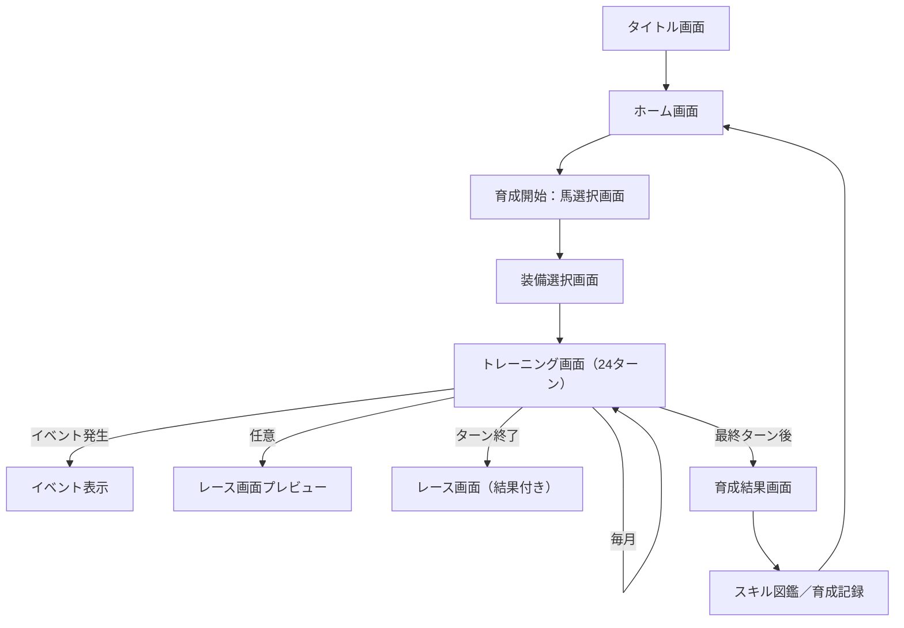

## 🧭 画面遷移図／ワイヤーフレーム仕様書

---

### ✅ 1. 画面遷移図（テキスト構成）

---

### ✅ 2. 各画面ワイヤーフレーム構成（要素構造）

#### 🏠 ホーム画面

* 「育成開始」ボタン
* 「スキル図鑑」「育成記録」メニュー
* 世界観テキスト or 背景演出

#### 🐎 馬選択画面

* 馬アイコン一覧（名前・初期ステ・適性）
* 馬詳細表示パネル（グラフ表示など）

#### 🧾 装備選択画面

* 騎手／馬／導法書それぞれスロット表示
* SSR装備カード一覧（フィルター／カテゴリ表示）
* 選択済み装備の効果一覧

#### 🏋️‍♀️ トレーニング画面（毎月）

* 月表示／ターン数／チャクラ気配
* ステータス／熟度／疲労ゲージ
* 6カテゴリのトレーニング候補カード
* 選択中トレの効果詳細（右）
* 下部：決定・休養・ログ確認ボタン

#### 💬 イベント表示

* フルスクリーン or 中央表示の選択肢ウィンドウ
* テキストログ → 選択肢 → 結果反映

#### 🏇 レース画面

* 区間進行バー／馬の順位表示
* スキルログ／共鳴演出
* 結果：順位／スコア／発動スキル

#### 🏁 育成結果画面

* 最終ステータス表示
* スキル開花一覧
* レース結果（勝敗・発動スキル）
* 総合スコア＋ランク演出
* 「記録へ保存」ボタン

#### 📘 スキル図鑑／育成記録

* スキル図鑑：タグ別フィルター、進行状況表示
* 育成記録：各周回の詳細／お気に入り機能

---

この仕様は初期開発のUI設計および画面ルーティング構成に利用可能です。視覚化が必要な場合は画像生成によるモックアップに発展可能です。